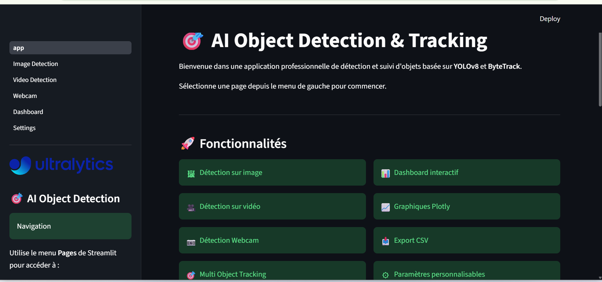
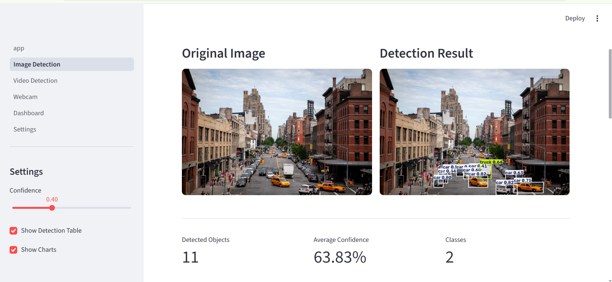
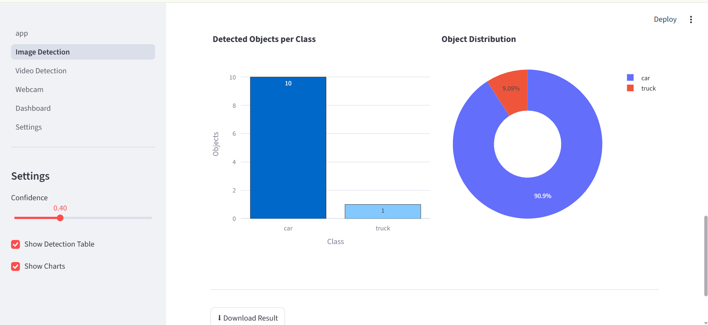
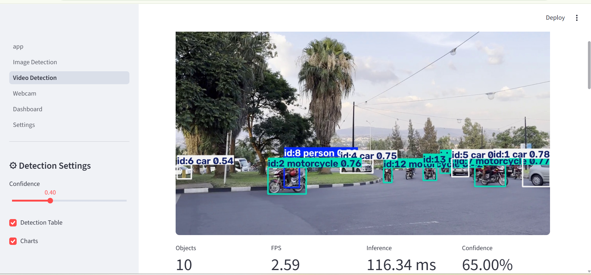
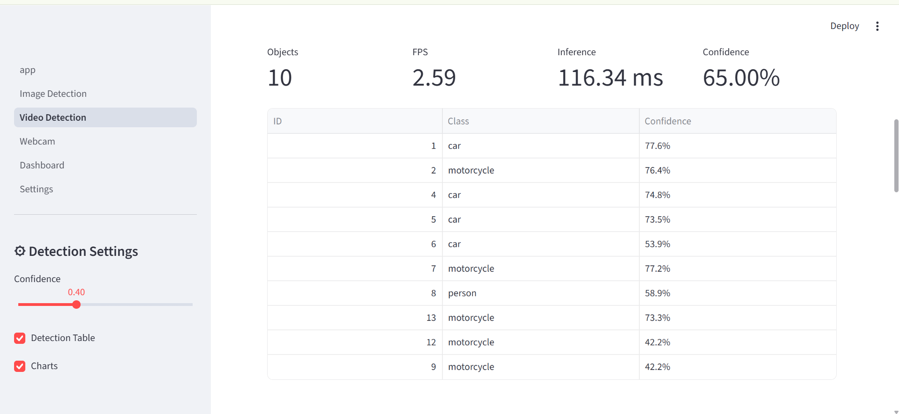
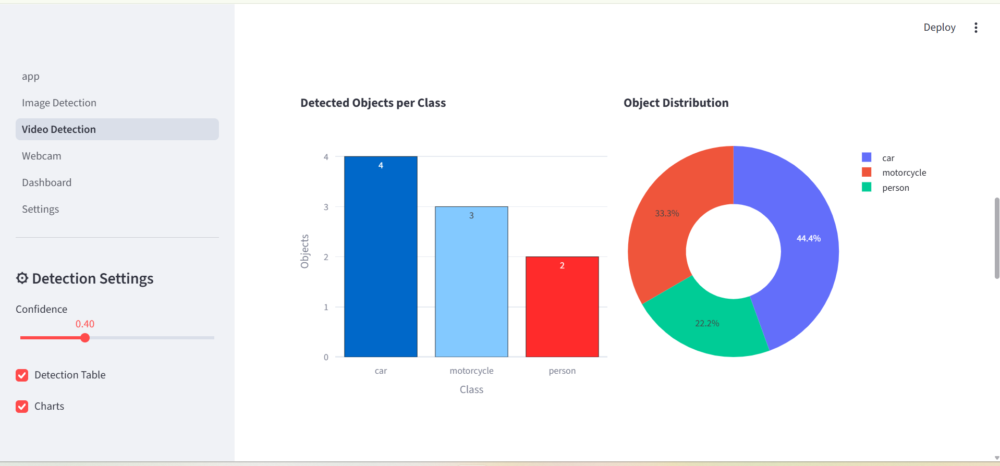
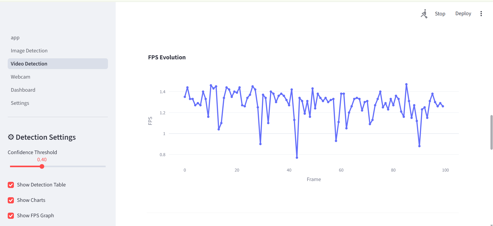
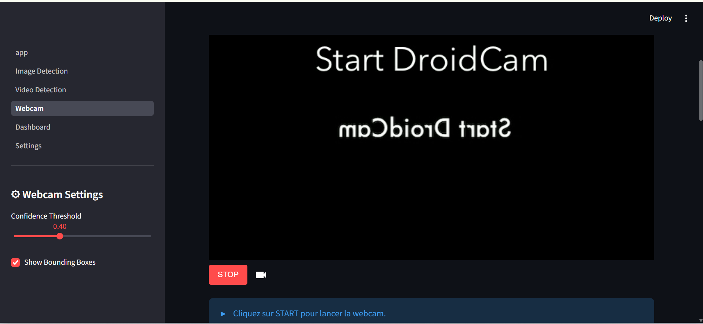
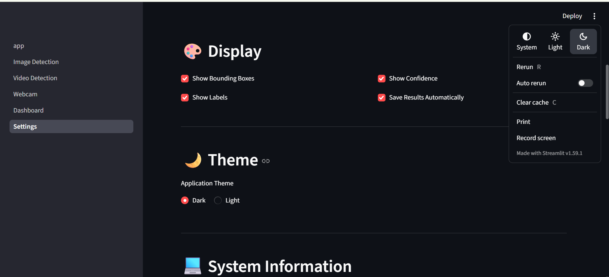

# 🎯 AI Object Detection and Tracking

An AI-powered Object Detection and Multi-Object Tracking application built with **YOLOv8**, **ByteTrack**, **OpenCV**, and **Streamlit**.

The application supports image detection, video detection, real-time webcam tracking, interactive dashboards, and performance monitoring.

---

# 🚀 Features

- 🖼️ Image Object Detection
- 🎥 Video Object Detection
- 📷 Real-Time Webcam Detection
- 🎯 Multi-Object Tracking (ByteTrack)
- 📊 Interactive Dashboard
- 📈 Live Performance Metrics
- 📋 Detection Table
- 📷 Snapshot Capture
- 📁 CSV Export
- ⚡ Real-Time FPS Monitoring
- 🎨 Modern Streamlit Interface

---

# 🛠 Technologies

- Python 3.11+
- Streamlit
- Ultralytics YOLOv8
- ByteTrack
- OpenCV
- Plotly
- Pandas
- NumPy

---

# 📂 Project Structure

```text
Object_Detection_and_Tracking/
│
├── app.py
├── config.py
├── detector.py
├── requirements.txt
├── README.md
├── style.css
│
├── assets/
│   └── screenshots/
│
├── models/
│
├── outputs/
│
├── pages/
│   ├── 1_Image_Detection.py
│   ├── 2_Video_Detection.py
│   ├── 3_Webcam.py
│   ├── 4_Dashboard.py
│   └── 5_Settings.py
│
├── utils/
│   ├── charts.py
│   ├── helpers.py
│   └── metrics.py
│
└── requirements.txt
```

---

# 📸 Screenshots

## Home



---

## Image Detection




---

## Video Detection






---

## Webcam Detection



---


## Settings



---

# ⚙️ Installation

Clone the repository

```bash
git clone https://github.com/YOUR_USERNAME/Object_Detection_and_Tracking.git
```

Open the project

```bash
cd Object_Detection_and_Tracking
```

Create a virtual environment

```bash
python -m venv venv
```

Activate it

Windows

```bash
venv\Scripts\activate
```

Linux / macOS

```bash
source venv/bin/activate
```

Install dependencies

```bash
pip install -r requirements.txt
```

---

# ▶️ Run the application

```bash
streamlit run app.py
```

The application will open automatically in your browser.

---

# 📊 Application Modules

## 🖼 Image Detection

- Upload image
- YOLOv8 Detection
- Bounding Boxes
- Detection Table
- Confidence Scores

---

## 🎥 Video Detection

- Upload Video
- Object Detection
- Multi Object Tracking
- Video Export
- Live Statistics

---

## 📷 Webcam Detection

- Live Webcam
- Real-Time Tracking
- FPS Monitoring
- Snapshot Capture
- Detection History

---

## 📊 Dashboard

- Live Statistics
- Performance Charts
- Detection Summary
- CSV Export

---

# 📈 Performance

The application displays:

- FPS
- Inference Time
- Object Count
- Average Confidence
- Class Distribution

---

# 📁 Output

Processed files are saved inside

```text
outputs/
```

Including

- processed images
- processed videos
- snapshots

---

# 🎯 Future Improvements

- Object Counting
- Heatmaps
- Zone Detection
- Face Detection
- Pose Estimation
- Instance Segmentation
- Custom YOLO Models
- GPU Optimization

---

# 👨‍💻 Author

**Atimad BEL CAID**

AI & Computer Vision Developer

---

# ⭐ If you like this project

Please consider giving it a ⭐ on GitHub.

---

# 📜 License

This project is released under the MIT License.